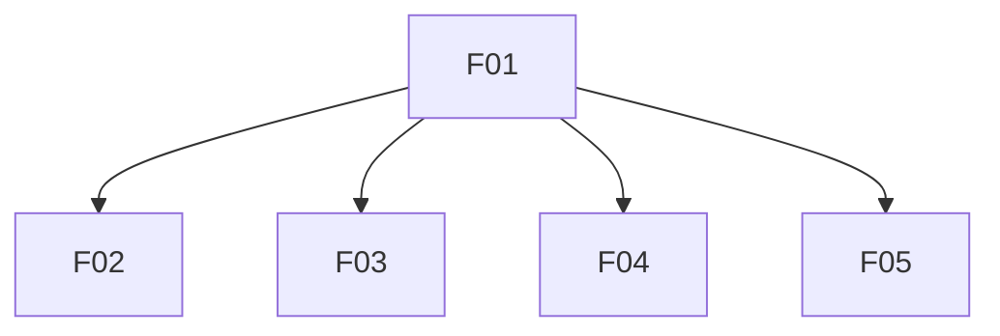

# Features List

| ID | Name | File | Traces to | Status | Summary |
|----|------|------|-----------|--------|---------|
| F01 | Site shell and navigation | [F01-site-shell-and-navigation](../2-features/F01-site-shell-and-navigation.md) | [GOL-02](stakeholders-and-goals.md#goals), [SCN-01](business-scenarios.md#scn-01-discover-expertise-and-request-consultation) | Implemented | Shared header, footer, routing, and layout so visitors reach About, services, and contact without dead ends. |
| F02 | Home landing page | [F02-home-landing-page](../2-features/F02-home-landing-page.md) | [GOL-02](stakeholders-and-goals.md#goals), [SCN-01](business-scenarios.md#scn-01-discover-expertise-and-request-consultation) | Implemented | Entry page with positioning and calls to action that start the discover-and-contact journey. |
| F03 | About and trust content | [F03-about-and-trust-content](../2-features/F03-about-and-trust-content.md) | [GOL-02](stakeholders-and-goals.md#goals), [SCN-01](business-scenarios.md#scn-01-discover-expertise-and-request-consultation) | Implemented | Presents expertise, credentials, geography, and trust figures so visitors judge consultant fit before contacting. |
| F04 | Services overview | [F04-services-overview](../2-features/F04-services-overview.md) | [GOL-02](stakeholders-and-goals.md#goals), [SCN-01](business-scenarios.md#scn-01-discover-expertise-and-request-consultation) | Implemented | Describes turnkey clinic, IVF/ART launch, and audit offerings for investors, clinic owners, and star doctors. |
| F05 | Contact inquiry capture | [F05-contact-inquiry-capture](../2-features/F05-contact-inquiry-capture.md) | [GOL-01](stakeholders-and-goals.md#goals), [SCN-01](business-scenarios.md#scn-01-discover-expertise-and-request-consultation) | Implemented | Contact form on `/contact`; successful submits notify owner via Resend (EVT-01). |

**Status:** `Draft` · `Specifying` · `Dev-ready` · `In development` · `Implemented` · `Cancelled` — transitions: [03-feature-lifecycle](../.cursor/rules/03-feature-lifecycle.mdc).

## Dependencies

**Rules:** direct deps only; no transitive arrows; no cycles; **Requires** = hard gate for **In development** ([06-traceability](../.cursor/rules/06-traceability.mdc)).
