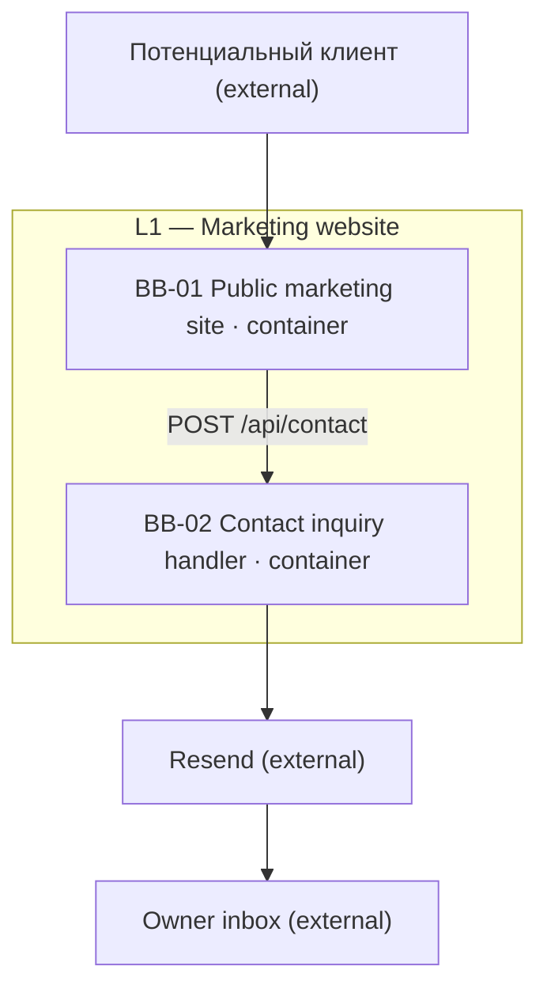
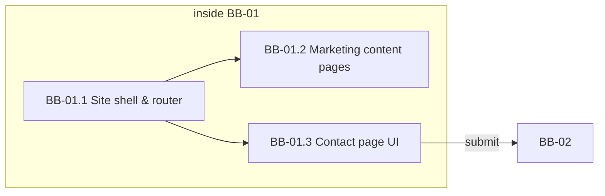
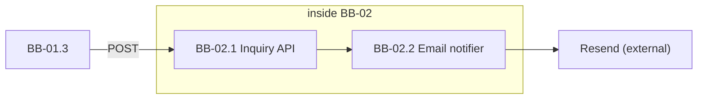

# Building Blocks

## Level 1 — Overall System

### Motivation

The product splits into a **public marketing site** (static pages + shared shell) and a **contact inquiry handler** (serverless API + email delivery). This matches the solution-strategy boundary ([ADR-01](solution-strategy.md#adr-01-full-stack-nextjs), [ADR-02](solution-strategy.md#adr-02-vercel-hosting)): five Russian marketing routes inside one Next.js app, plus one Route Handler for lead capture. F01–F04 are read-only presentation; F05 spans browser UI (BB-01) and server processing (BB-02).

### Overview Diagram

### Building Block Summary

| ID | Level | Parent | Type | Name | Responsibility | Features |
|----|-------|--------|------|------|----------------|----------|
| BB-01 | L1 | — | container | Public marketing site | Next.js App Router shell, static marketing pages, contact form UI | F01, F02, F03, F04, F05 |
| BB-02 | L1 | — | container | Contact inquiry handler | Accept inquiries, anti-abuse, owner notification via Resend | F05 |

### BB-01: Public marketing site

**Level:** L1 · **Parent:** — · **Type:** container · **Children:** BB-01.1, BB-01.2, BB-01.3

**Responsibility:** Serve the Russian marketing website — shared chrome (header, nav, footer), file-based routes for Home, About, Services, and Contact, static content at build time, and client-side form interaction on Contact. Does **not** persist inquiry data, send email, or integrate with CRM.

**Features:** [F01](../2-features/F01-site-shell-and-navigation.md), [F02](../2-features/F02-home-landing-page.md), [F03](../2-features/F03-about-and-trust-content.md), [F04](../2-features/F04-services-overview.md), [F05](../2-features/F05-contact-inquiry-capture.md) (UI only)

**Interfaces (provided):** HTML pages (`/`, `/about`, `/services`, `/contact`); `lang="ru"` document shell; primary navigation; JSON `POST` body to BB-02 from contact form

**Interfaces (required):** BB-02 HTTP API for form submit (`POST /api/contact`)

**Dependencies:** BB-02 (contact submit)

### BB-02: Contact inquiry handler

**Level:** L1 · **Parent:** — · **Type:** container · **Children:** BB-02.1, BB-02.2

**Responsibility:** Validate and accept contact inquiries, apply honeypot and rate limiting, emit EVT-01, and deliver owner notification email. Does **not** render marketing pages or store leads in a database.

**Features:** [F05](../2-features/F05-contact-inquiry-capture.md)

**Interfaces (provided):** `POST /api/contact` — accepts `ContactInquiry` JSON; returns success/error for UI

**Interfaces (required):** Resend transactional API; `OWNER_NOTIFICATION_EMAIL` and `RESEND_API_KEY` env vars

**Dependencies:** Resend (external)

## Level 2 — White Box: BB-01 Public marketing site

### Overview Diagram

### Building Block Summary

| ID | Level | Parent | Type | Name | Responsibility |
|----|-------|--------|------|------|----------------|
| BB-01.1 | L2 | BB-01 | leaf | Site shell & router | Root layout, App Router, header/footer/nav, `SiteConfig` |
| BB-01.2 | L2 | BB-01 | leaf | Marketing content pages | SSG routes and static content for Home, About, Services |
| BB-01.3 | L2 | BB-01 | leaf | Contact page UI | Form fields, client validation, success/error states |

### BB-01.1: Site shell & router

**Level:** L2 · **Parent:** BB-01 · **Type:** leaf

**Responsibility:** `app/layout.tsx` wrapper, route resolution, site identity in header, primary nav (Главная, Обо мне, Услуги, Контакты), footer nav repeat, active-route styling, responsive mobile nav, main content slot for child routes, branded not-found inside shell.

**Features:** [F01](../2-features/F01-site-shell-and-navigation.md)

**Interfaces (provided):** Shared layout component; `SiteConfig` (site name, nav items)

**Interfaces (required):** Child page components from BB-01.2 and BB-01.3

**Dependencies:** BB-01.2, BB-01.3 (mounts in main region)

### BB-01.2: Marketing content pages

**Level:** L2 · **Parent:** BB-01 · **Type:** leaf

**Responsibility:** Static TypeScript/JSON content modules and page components for `/` (home), `/about`, and `/services`; SSG at build time per [ADR-06](solution-strategy.md#adr-06-russian-only-static-content); SEO metadata per route.

**Features:** [F02](../2-features/F02-home-landing-page.md), [F03](../2-features/F03-about-and-trust-content.md), [F04](../2-features/F04-services-overview.md)

**Interfaces (provided):** `HomePageContent`, `AboutPageContent`, `ServicesPageContent` rendered in shell main region

**Interfaces (required):** BB-01.1 layout and router

**Dependencies:** BB-01.1

### BB-01.3: Contact page UI

**Level:** L2 · **Parent:** BB-01 · **Type:** leaf

**Responsibility:** `/contact` page intro copy, inquiry form (name, email, phone, message), client-side required-field and email validation, honeypot field (hidden), submit to BB-02, success and retryable error feedback.

**Features:** [F05](../2-features/F05-contact-inquiry-capture.md) — FR-F05-01–FR-F05-04, FR-F05-07, FR-F05-08, FR-F05-10

**Interfaces (provided):** Contact form UI; `ContactPageContent` static copy

**Interfaces (required):** BB-02 `POST /api/contact`

**Dependencies:** BB-01.1, BB-02

## Level 2 — White Box: BB-02 Contact inquiry handler

### Overview Diagram

### Building Block Summary

| ID | Level | Parent | Type | Name | Responsibility |
|----|-------|--------|------|------|----------------|
| BB-02.1 | L2 | BB-02 | leaf | Inquiry API | Route Handler: validate, honeypot, rate limit, EVT-01 |
| BB-02.2 | L2 | BB-02 | leaf | Email notifier | Resend client; owner notification message |

### BB-02.1: Inquiry API

**Level:** L2 · **Parent:** BB-02 · **Type:** leaf

**Responsibility:** `app/api/contact/route.ts` — parse and server-validate `ContactInquiry`, reject filled honeypot, enforce per-IP rate limit ([ADR-04](solution-strategy.md#adr-04-honeypot-and-rate-limiting)), set `submittedAt`, emit EVT-01, invoke email notifier on success.

**Features:** [F05](../2-features/F05-contact-inquiry-capture.md) — FR-F05-05

**Interfaces (provided):** `POST /api/contact` JSON API

**Interfaces (required):** BB-02.2 for notification delivery

**Dependencies:** BB-02.2

### BB-02.2: Email notifier

**Level:** L2 · **Parent:** BB-02 · **Type:** leaf

**Responsibility:** Send transactional email to owner inbox via Resend API ([ADR-03](solution-strategy.md#adr-03-resend-email-delivery)); read `OWNER_NOTIFICATION_EMAIL` (default `medvedeva19889@gmail.com`); include inquiry fields in message body; no site persistence.

**Features:** [F05](../2-features/F05-contact-inquiry-capture.md) — FR-F05-06

**Interfaces (provided):** Internal `sendOwnerNotification(inquiry)` used by BB-02.1

**Interfaces (required):** Resend REST API; verified sender domain; `RESEND_API_KEY`

**Dependencies:** Resend (external)

## External Systems

| System | Role | Interface to | Features |
|--------|------|--------------|----------|
| Resend | Transactional email delivery for inquiry notifications | BB-02.2 | F05 |
| Owner inbox (`medvedeva19889@gmail.com`) | Receives EVT-01 notification emails; not shown on public site | BB-02.2 (via Resend) | F05 |
| Vercel | CDN + serverless hosting for BB-01 static assets and BB-02 Route Handler | BB-01, BB-02 | F01–F05 |

## Deployment View

| Block | Runtime | Notes |
|-------|---------|-------|
| BB-01 | Vercel Edge CDN + Node (SSG/ISR) | Marketing routes pre-rendered; Tailwind assets bundled at build ([ADR-02](solution-strategy.md#adr-02-vercel-hosting), [ADR-05](solution-strategy.md#adr-05-tailwind-css-styling)) |
| BB-02 | Vercel serverless function | Same Next.js deploy; `app/api/contact/route.ts` cold-starts on submit |
| BB-02.2 → Resend | External SaaS | API key in Vercel project env |

**Runtime flows:** [runtime-views.md](runtime-views.md)
