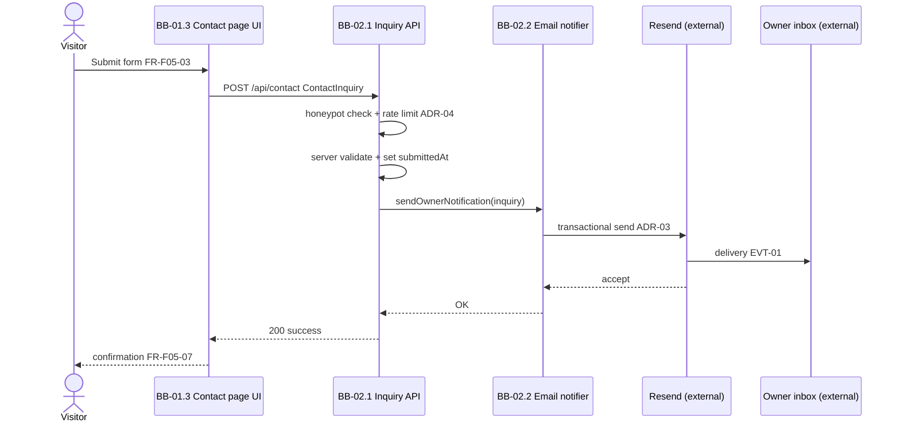
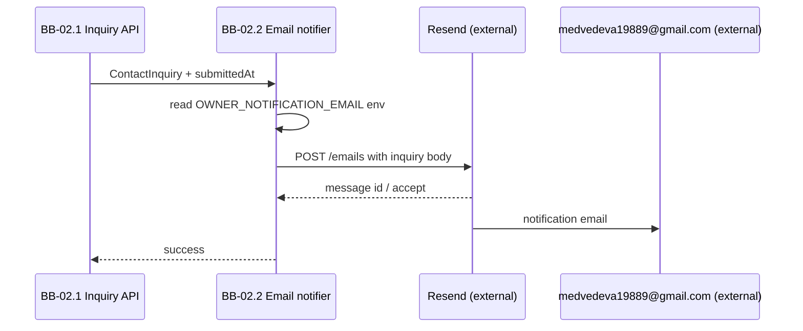

# Runtime Views

## Two-layer model

| Layer | File |
|-------|------|
| Feature | `F##_*.md` → **Runtime flow** |
| Architecture | `runtime-views.md` → `RT-##` |

## What belongs here

**Include:** multi-block flows; external integrations; security and anti-abuse; shared error and degradation patterns.

**Exclude:** single-block static page serving (F01–F04 → feature **Runtime flow**); screen layout → feature **UI flow**; entity fields → [db-and-dfd.md](../4-design/db-and-dfd.md).

## Scenario Index

| ID | Name | Category | Trigger | Features | Blocks | Notation |
|----|------|----------|---------|----------|--------|----------|
| RT-01 | Contact inquiry submission | Use case | Visitor submits Contact form | F05 | BB-01.3, BB-02.1, BB-02.2, Resend (external) | sequence |
| RT-02 | Owner notification via Resend | External interface | BB-02.1 accepts valid inquiry | F05 | BB-02.2, Resend (external), Owner inbox (external) | sequence |

## Use case scenarios

### RT-01: Contact inquiry submission

**Category:** Use case · **Trigger:** Visitor clicks submit on `/contact` with valid client-side input

**Building blocks:** [BB-01.3](building-blocks.md#bb-01-3), [BB-02.1](building-blocks.md#bb-02-1), [BB-02.2](building-blocks.md#bb-02-2)

**Features:** [F05](../2-features/F05-contact-inquiry-capture.md) · **Traces to:** [SCN-01](../1-scope/business-scenarios.md#scn-01-discover-expertise-and-request-consultation), [EVT-01](../1-scope/business-scenarios.md#business-events), [FR-F05-05](../2-features/F05-contact-inquiry-capture.md#functional-requirements), [FR-F05-06](../2-features/F05-contact-inquiry-capture.md#functional-requirements), [NFR-04](solution-strategy.md#nfr-04-security), [NFR-05](solution-strategy.md#nfr-05-contact-delivery)

#### Scenario

#### Notable aspects

- **Security:** Honeypot field rejected server-side if filled; per-IP rate limit on `POST /api/contact` ([ADR-04](solution-strategy.md#adr-04-honeypot-and-rate-limiting)).
- **Data:** `ContactInquiry` is transient — not persisted on site ([NFR-08](solution-strategy.md#nfr-08-privacy)).
- **Failure:** Resend or validation errors return retryable response to UI ([FR-F05-08](2-features/F05-contact-inquiry-capture.md#functional-requirements)).

#### Alternate / error paths

| Condition | Behaviour | Blocks |
|-----------|-----------|--------|
| Client validation fails | Inline errors; no API call | BB-01.3 |
| Honeypot filled | 400 rejected silently or generic error | BB-02.1 |
| Rate limit exceeded | 429 with retry-after guidance | BB-02.1 |
| Server validation fails | 400 with field errors | BB-02.1 |
| Resend API error | 502/503; form data preserved for retry | BB-02.1, BB-02.2 |

## External interface scenarios

### RT-02: Owner notification via Resend

**Category:** External interface · **Trigger:** BB-02.1 invokes email notifier after accepting inquiry

**Building blocks:** [BB-02.2](building-blocks.md#bb-02-2), Resend (external), Owner inbox (external)

**Features:** [F05](../2-features/F05-contact-inquiry-capture.md) · **Traces to:** [EVT-01](../1-scope/business-scenarios.md#business-events), [FR-F05-06](../2-features/F05-contact-inquiry-capture.md#functional-requirements), [ADR-03](solution-strategy.md#adr-03-resend-email-delivery)

#### Scenario

#### Notable aspects

- **Config:** `RESEND_API_KEY` and verified sender domain in Vercel env; owner address not exposed on public site.
- **SLA:** Delivery depends on Resend; target ≥99% accept within 30 s ([NFR-05](solution-strategy.md#nfr-05-contact-delivery)).

## Error and degradation patterns

| Pattern | Trigger | Behaviour | RT-## | Blocks |
|---------|---------|-----------|-------|--------|
| Honeypot rejection | Bot fills hidden field | Reject submit; no email | RT-01 | BB-02.1 |
| Rate limit | >5 POST / 15 min per IP | 429; visitor may retry later | RT-01 | BB-02.1 |
| Resend unavailable | API timeout or 5xx | Error state on form; retry allowed | RT-01, RT-02 | BB-02.2 |
| Vercel function cold start | First submit after idle | Added latency; no data loss | RT-01 | BB-02.1 |

## Notation reference

| Shape | Prefer |
|-------|--------|
| API chain | `sequenceDiagram` |
| Branching validation | error paths table + feature **Runtime flow** |
| Lifecycle | `stateDiagram-v2` |

**Static ↔ runtime:** new participant → update [building-blocks.md](building-blocks.md) first.
