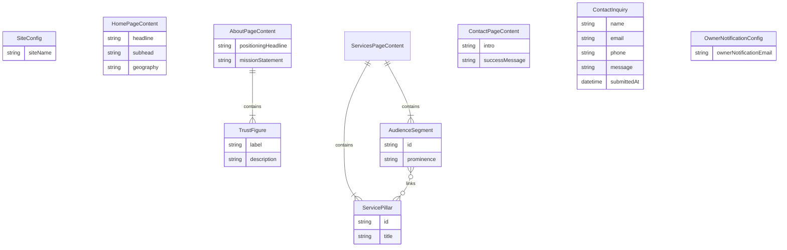
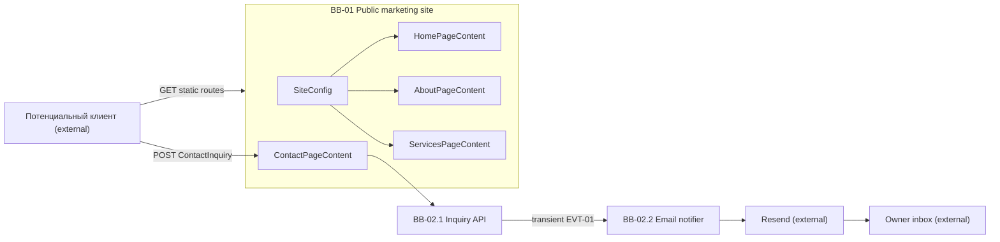

# Database and Data Flow

No persistent database at launch — marketing copy is static at build time; contact inquiries are transient through the API to owner email only ([NFR-08](../3-arch/solution-strategy.md#nfr-08-privacy)).

## Entity-Relationship

## Data Flow

## Data Dictionary

| Entity | Field | Type | Required | Description |
|--------|-------|------|----------|-------------|
| SiteConfig | siteName | string | Yes | Header display name — default «Юлия Медведева» (F01) |
| SiteConfig | navItems | array | Yes | Route id, RU label, path for primary nav (F01) |
| HomePageContent | headline | string | Yes | Primary positioning line (F02) |
| HomePageContent | subhead | string | Yes | ВРТ/ЭКО and turnkey focus (F02) |
| HomePageContent | geography | string | Yes | RF, KZ, UZ markets (F02) |
| HomePageContent | investorHook | string | Yes | Turnkey / safe-investment teaser (F02) |
| HomePageContent | clinicOwnerHook | string | Yes | IVF/ART launch teaser (F02) |
| HomePageContent | portraitUrl | string | No | Optional hero image; null → placeholder (F02) |
| HomePageContent | ctaPrimary | object | Yes | Label + `/contact` route (F02) |
| HomePageContent | ctaSecondary | array | Yes | About and Services CTAs (F02) |
| AboutPageContent | positioningHeadline | string | Yes | Expert positioning (F03) |
| AboutPageContent | positioningSubhead | string | Yes | CEO/managing partner, 10+ years (F03) |
| AboutPageContent | portraitUrl | string | No | Optional; null → placeholder (F03) |
| AboutPageContent | trustFigures | array | Yes | Four TrustFigure entries (F03) |
| AboutPageContent | backgroundNarrative | string | Yes | Clinician-to-executive story (F03) |
| AboutPageContent | missionStatement | string | Yes | Medical ideas → high-margin business (F03) |
| AboutPageContent | geography | string | Yes | RF, KZ, UZ + EU approaches (F03) |
| AboutPageContent | ctaServices | object | Yes | Label + `/services` (F03) |
| AboutPageContent | ctaContact | object | Yes | Label + `/contact` (F03) |
| TrustFigure | label | string | Yes | Short stat label (F03) |
| TrustFigure | description | string | Yes | Supporting line (F03) |
| ServicesPageContent | intro | string | Yes | Safety, speed, experience framing (F04) |
| ServicesPageContent | pillars | array | Yes | Three ServicePillar objects (F04) |
| ServicesPageContent | segments | array | Yes | Three AudienceSegment objects (F04) |
| ServicesPageContent | ctaContact | object | Yes | Label + `/contact` (F04) |
| ServicePillar | id | string | Yes | `turnkey` \| `ivf-launch` \| `audit` (F04) |
| ServicePillar | title | string | Yes | Pillar heading (F04) |
| ServicePillar | description | string | Yes | Scope summary (F04) |
| ServicePillar | offerings | array | Yes | Deliverable bullets (F04) |
| AudienceSegment | id | string | Yes | `investor` \| `clinic-owner` \| `star-doctor` (F04) |
| AudienceSegment | prominence | string | Yes | `primary` or `supporting` (F04) |
| AudienceSegment | profile | string | Yes | Client profile (F04) |
| AudienceSegment | painPoints | array | Yes | Segment pains (F04) |
| AudienceSegment | linkedPillarIds | array | Yes | References to ServicePillar ids (F04) |
| ContactPageContent | intro | string | Yes | Consulting inquiry invitation (F05) |
| ContactPageContent | successMessage | string | Yes | Post-submit confirmation (F05) |
| ContactPageContent | errorMessage | string | Yes | Generic failure copy (F05) |
| ContactInquiry | name | string | Yes | Submitter name — transient (F05) |
| ContactInquiry | email | string | Yes | Valid email format (F05) |
| ContactInquiry | phone | string | No | Optional phone (F05) |
| ContactInquiry | message | string | Yes | Inquiry body (F05) |
| ContactInquiry | submittedAt | datetime | Yes | Set server-side on accept (F05) |
| OwnerNotificationConfig | ownerNotificationEmail | string | Yes | Resend `to` address — env only, not on site (F05) |

**Sources:** feature data models in [F01](../2-features/F01-site-shell-and-navigation.md)–[F05](../2-features/F05-contact-inquiry-capture.md); [building-blocks.md](../3-arch/building-blocks.md).
