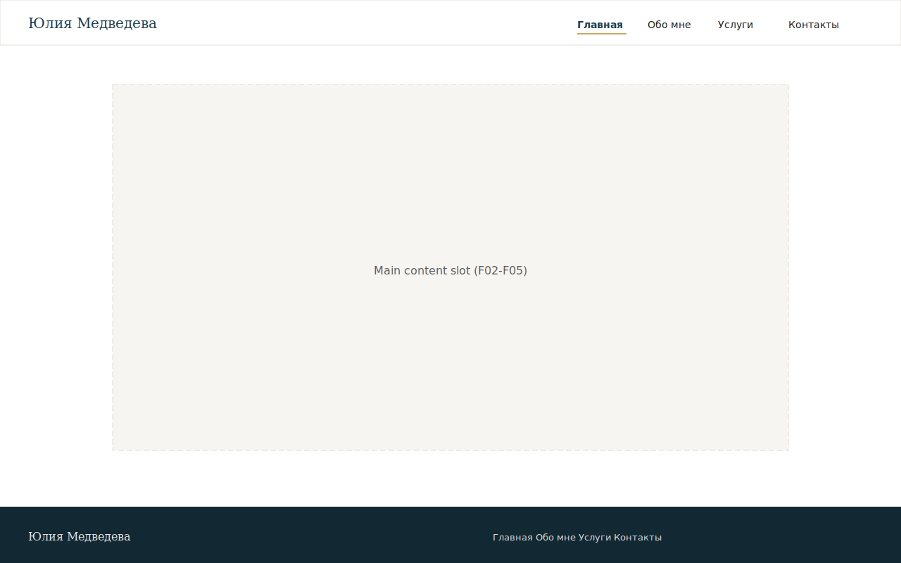
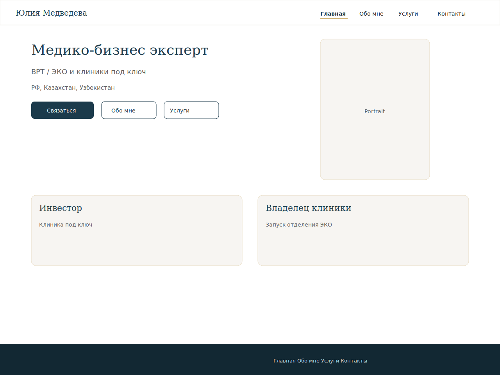
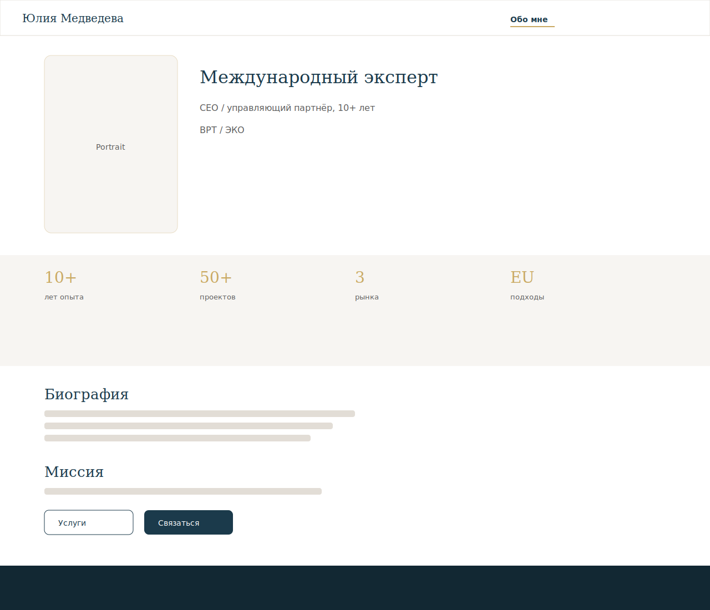
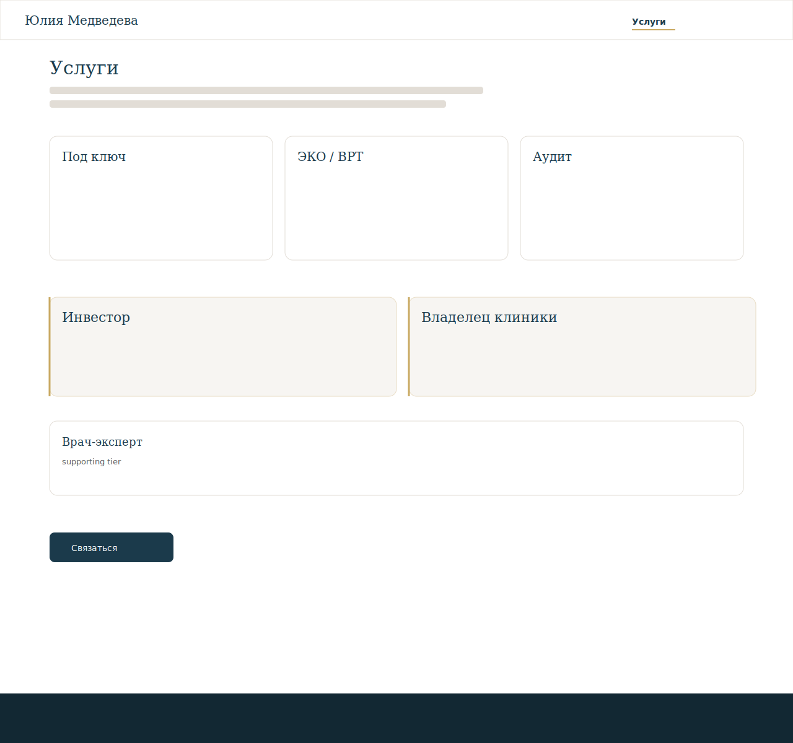
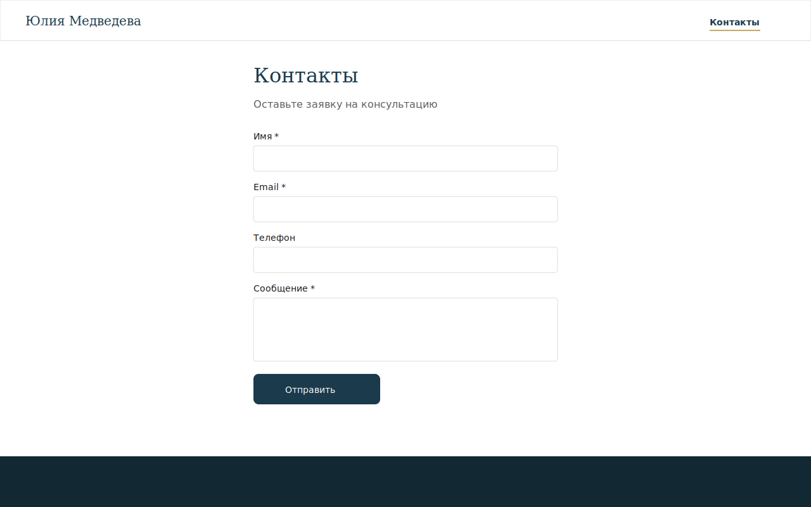
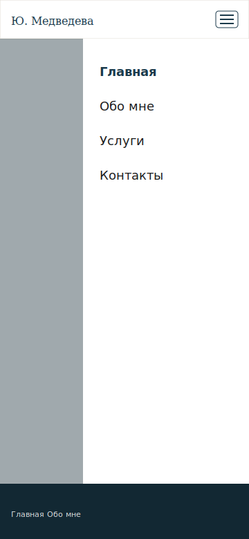
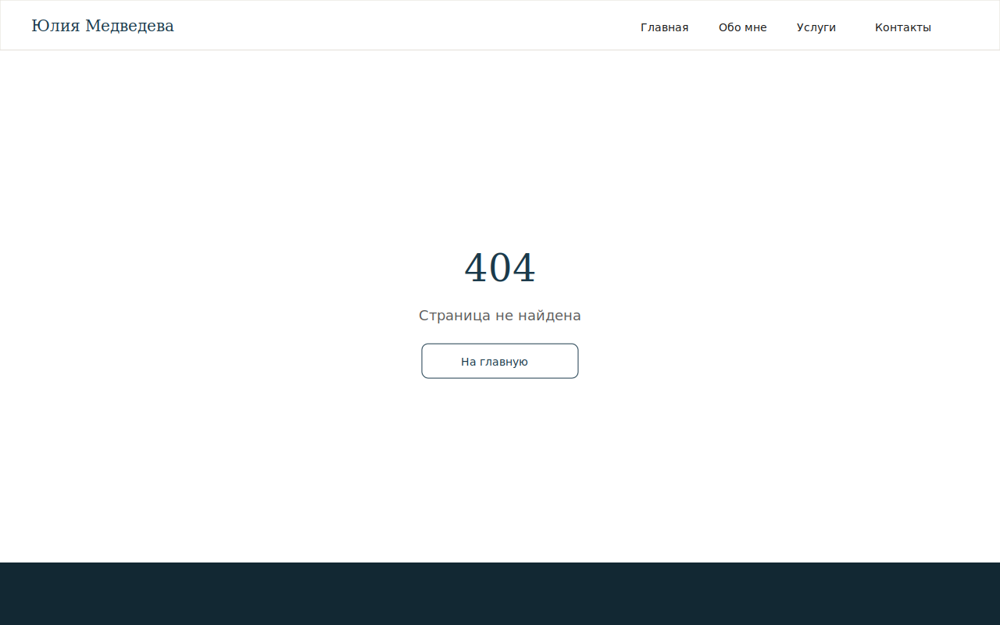

# Mockups

Screen specs and SVG assets for Must-path views. Component definitions: [design-strategy.md](design-strategy.md#component-inventory). Tokens: [library.md](library.md).

| ID | Screen | File | Feature(s) | Journey | Route | Status |
|----|--------|------|------------|---------|-------|--------|
| MCK-01 | Site shell — header and footer | [MCK-01-site-shell.svg](mockups/screens/MCK-01-site-shell.svg) | F01 | JRN-01 | `*` | Draft |
| MCK-02 | Home | [MCK-02-home.svg](mockups/screens/MCK-02-home.svg) | F01, F02 | JRN-01 | `/` | Draft |
| MCK-03 | About | [MCK-03-about.svg](mockups/screens/MCK-03-about.svg) | F01, F03 | JRN-01 | `/about` | Draft |
| MCK-04 | Services | [MCK-04-services.svg](mockups/screens/MCK-04-services.svg) | F01, F04 | JRN-01 | `/services` | Draft |
| MCK-05 | Contact | [MCK-05-contact.svg](mockups/screens/MCK-05-contact.svg) | F01, F05 | JRN-01 | `/contact` | Draft |
| MCK-06 | Mobile nav open | [MCK-06-mobile-nav.svg](mockups/screens/MCK-06-mobile-nav.svg) | F01 | JRN-01 | `*` | Draft |
| MCK-07 | Not found | [MCK-07-not-found.svg](mockups/screens/MCK-07-not-found.svg) | F01 | — | `*` | Draft |

## MCK-01: Site shell — header and footer {#mck-01-site-shell}

**Feature:** [F01](../2-features/F01-site-shell-and-navigation.md) · **Components:** [CMP-01](design-strategy.md#cmp-01-site-header), [CMP-03](design-strategy.md#cmp-03-site-footer), [CMP-04](design-strategy.md#cmp-04-main-content-slot)

**Layout (planned):**

- Top: identity «Юлия Медведева» (home link) left; horizontal nav right (Главная, Обо мне, Услуги, Контакты); active route underlined
- Main: empty slot placeholder showing max-width content column
- Bottom: dark footer with repeated nav links and site name
- Desktop ≥768px; documents chrome shared by MCK-02–MCK-05

## MCK-02: Home {#mck-02-home}

**Feature:** [F02](../2-features/F02-home-landing-page.md) · **Components:** [CMP-07](design-strategy.md#cmp-07-hero-block), [CMP-09](design-strategy.md#cmp-09-portrait-frame), [CMP-08](design-strategy.md#cmp-08-segment-teaser-pair), [CMP-05](design-strategy.md#cmp-05-primary-button), [CMP-06](design-strategy.md#cmp-06-secondary-button)

**Layout (planned):**

- Shell (MCK-01) with hero: headline + subhead + geography left, portrait right
- Below hero: two equal segment teaser cards (investor / clinic owner)
- CTA row: primary «Связаться» → Contact; secondary links to About and Services

## MCK-03: About {#mck-03-about}

**Feature:** [F03](../2-features/F03-about-and-trust-content.md) · **Components:** [CMP-09](design-strategy.md#cmp-09-portrait-frame), [CMP-11](design-strategy.md#cmp-11-content-section), [CMP-10](design-strategy.md#cmp-10-trust-figures-grid), [CMP-05](design-strategy.md#cmp-05-primary-button), [CMP-06](design-strategy.md#cmp-06-secondary-button)

**Layout (planned):**

- Positioning section: portrait + name + expert headline + 10+ years / ВРТ/ЭКО subhead
- Trust figures: 2×2 grid (four stats)
- Background narrative and mission sections (prose)
- Geography line (РФ, KZ, UZ, EU approaches)
- End CTAs to Services and Contact

## MCK-04: Services {#mck-04-services}

**Feature:** [F04](../2-features/F04-services-overview.md) · **Components:** [CMP-11](design-strategy.md#cmp-11-content-section), [CMP-12](design-strategy.md#cmp-12-service-pillar-card), [CMP-13](design-strategy.md#cmp-13-audience-segment-block), [CMP-05](design-strategy.md#cmp-05-primary-button)

**Layout (planned):**

- Intro paragraph (safety, speed, experience)
- Three pillar cards in a row: turnkey, ЭКО/ВРТ launch, audit
- Segment blocks: investor and clinic-owner equal tier; star-doctor supporting tier below
- Bottom primary CTA to Contact

## MCK-05: Contact {#mck-05-contact}

**Feature:** [F05](../2-features/F05-contact-inquiry-capture.md) · **Components:** [CMP-11](design-strategy.md#cmp-11-content-section), [CMP-14](design-strategy.md#cmp-14-contact-form), [CMP-15](design-strategy.md#cmp-15-form-field), [CMP-16](design-strategy.md#cmp-16-form-status-message)

**Layout (planned):**

- Short intro inviting consulting inquiry
- Form: name, email, phone (optional), message, submit button
- Success or error status area below submit
- No visible owner email or phone

## MCK-06: Mobile nav open {#mck-06-mobile-nav}

**Feature:** [F01](../2-features/F01-site-shell-and-navigation.md) · **Components:** [CMP-01](design-strategy.md#cmp-01-site-header), [CMP-02](design-strategy.md#cmp-02-mobile-nav-drawer)

**Layout (planned):**

- Viewport ≤768px: header with identity + hamburger (nav links hidden)
- Drawer open: overlay + vertical stack of four nav links
- Illustrates FR-F01-06 mobile navigation state

## MCK-07: Not found {#mck-07-not-found}

**Feature:** [F01](../2-features/F01-site-shell-and-navigation.md) · **Components:** [CMP-17](design-strategy.md#cmp-17-not-found-content)

**Layout (planned):**

- Shell with centred 404 message and link back to home
- Same header/footer as MCK-01
