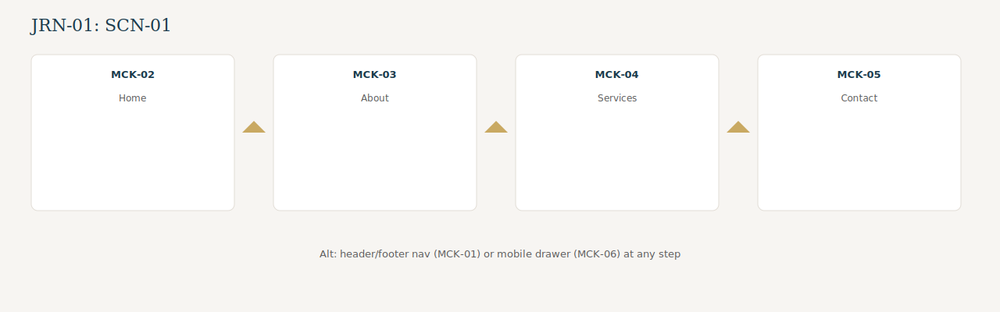
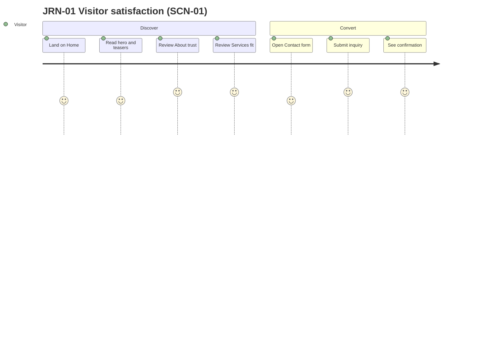

# User Journeys

End-to-end paths for Must-scope scenarios. Screen mockups: [mockups.md](mockups.md). Components: [design-strategy.md](design-strategy.md#component-inventory).

## JRN-01: Discover expertise and request consultation {#jrn-01-discover-and-contact}

**Persona:** Потенциальный клиент (инвестор STK-02, владелец клиники STK-03, или врач-эксперт STK-04) · **Goal:** Decide that Юлия Медведева is the right consultant and submit an inquiry · **Features:** [F01](../2-features/F01-site-shell-and-navigation.md), [F02](../2-features/F02-home-landing-page.md), [F03](../2-features/F03-about-and-trust-content.md), [F04](../2-features/F04-services-overview.md), [F05](../2-features/F05-contact-inquiry-capture.md)

**Traces to:** [SCN-01](../1-scope/business-scenarios.md#scn-01-discover-expertise-and-request-consultation), [GOL-01](../1-scope/stakeholders-and-goals.md#goals), [GOL-02](../1-scope/stakeholders-and-goals.md#goals)

### Steps

| Step | Action | Feature | UI state |
|------|--------|---------|----------|
| 1 | Lands on Home (referral, search, or direct URL) | F01, F02 | [MCK-02](mockups.md#mck-02-home) |
| 2 | Scans hero positioning, geography, and segment teasers | F02 | [MCK-02](mockups.md#mck-02-home) |
| 3 | Uses header or footer nav to reach About (or home secondary CTA) | F01, F03 | [MCK-01](mockups.md#mck-01-site-shell) → [MCK-03](mockups.md#mck-03-about) |
| 4 | Reads positioning, portrait, and trust figures | F03 | [MCK-03](mockups.md#mck-03-about) |
| 5 | Continues to Services via CTA or nav | F01, F04 | [MCK-04](mockups.md#mck-04-services) |
| 6 | Reviews service pillars and audience segment blocks | F04 | [MCK-04](mockups.md#mck-04-services) |
| 7 | Navigates to Contact via CTA or nav | F01, F05 | [MCK-05](mockups.md#mck-05-contact) |
| 8 | Fills name, email, optional phone, message; submits form | F05 | [MCK-05](mockups.md#mck-05-contact) |
| 9 | Sees success confirmation (owner notified via EVT-01) | F05 | [MCK-05](mockups.md#mck-05-contact) |

**Alternate — mobile nav:** At any step on viewport ≤768px, visitor opens hamburger menu and selects destination ([FR-F01-06](../2-features/F01-site-shell-and-navigation.md#functional-requirements)) → [MCK-06](mockups.md#mck-06-mobile-nav).

**Alternate — early exit:** Visitor leaves without contacting → no system action ([SCN-01](../1-scope/business-scenarios.md#scn-01-discover-expertise-and-request-consultation) alternate flow).

**Out of JRN-01:** [MCK-07](mockups.md#mck-07-not-found) — unknown route inside shell (F01 error path).

### Visual flow

Step embeds (primary path):

| Step | Screen |
|------|--------|
| 1–2 |  |
| 3–4 |  |
| 5–6 |  |
| 7–9 |  |

### Journey diagram

