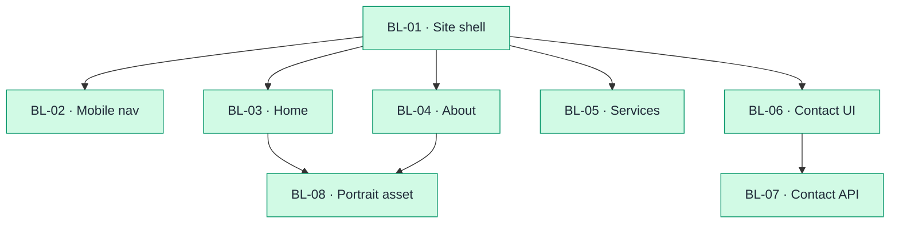

# Backlog

| ID | Feature | Title | Type | Priority | Status | Dependencies |
|----|---------|-------|------|----------|--------|--------------|
| BL-01 | F01 | App scaffold and site shell | Story | Must | Done | — |
| BL-02 | F01 | Mobile navigation | Story | Must | Done | BL-01 |
| BL-03 | F02 | Home landing page | Story | Must | Done | BL-01 |
| BL-04 | F03 | About and trust content | Story | Must | Done | BL-01 |
| BL-05 | F04 | Services overview | Story | Must | Done | BL-01 |
| BL-06 | F05 | Contact page UI and validation | Story | Must | Done | BL-01 |
| BL-07 | F05 | Contact inquiry API and owner notification | Story | Must | Done | BL-06 |
| BL-08 | F02, F03 | Owner portrait asset | Story | Must | Done | BL-03, BL-04 |

## Suggested implementation order

1. BL-01
2. BL-02
3. BL-03
4. BL-04
5. BL-05
6. BL-06
7. BL-07
8. BL-08

Respect **Dependencies** — a `BL-##` is not eligible until every listed dependency is `Done`.

## Dependency diagram

Node fill = **Status** (update `class` lines when status changes).

| Status | Color |
|--------|-------|
| Todo | Amber |
| In Progress | Blue |
| Done | Green |

| Item | Depends on | Notes |
|------|------------|-------|
| BL-01 | — | Next.js scaffold + shared layout; root for all routes |
| BL-02 | BL-01 | Mobile drawer extends shell header |
| BL-03 | BL-01 | Home content in main slot |
| BL-04 | BL-01 | About content in main slot |
| BL-05 | BL-01 | Services content in main slot |
| BL-06 | BL-01 | Contact form UI; no API yet |
| BL-07 | BL-06 | `POST /api/contact`, Resend, honeypot, rate limit |
| BL-08 | BL-03, BL-04 | Portrait JPEG in `public/`; `portraitUrl` on Home and About |

**Rules:** direct deps only; no transitive arrows; no cycles; **Depends on** = hard gate for implementation order.

## BL-01: App scaffold and site shell {#bl-01}

**Feature:** [F01-site-shell-and-navigation](../2-features/F01-site-shell-and-navigation.md)
**Traces to:** [FR-F01-01](../2-features/F01-site-shell-and-navigation.md#functional-requirements), [FR-F01-02](../2-features/F01-site-shell-and-navigation.md#functional-requirements), [FR-F01-03](../2-features/F01-site-shell-and-navigation.md#functional-requirements), [FR-F01-04](../2-features/F01-site-shell-and-navigation.md#functional-requirements), [FR-F01-07](../2-features/F01-site-shell-and-navigation.md#functional-requirements)
**Dependencies:** —
**Tests:** [TC-01](testing-plan.md#tc-01)
**Mockups:** [MCK-01](../4-design/mockups.md#mck-01-site-shell), [MCK-07](../4-design/mockups.md#mck-07-not-found)
**Acceptance criteria:**
- [x] Given any page, when the visitor clicks the header identity, then the home route loads inside the shell (FR-F01-01)
- [x] Given the shell on any page, when the visitor opens each nav item, then the corresponding page route loads without full-site dead ends (FR-F01-02)
- [x] Given a child route (F02–F05), when the route loads, then its content appears in the main region within the shared header and footer (FR-F01-03)
- [x] Given any page, when the visitor scrolls to the footer, then the same primary destinations are available as in the header (FR-F01-04)
- [x] Given the visitor is on About, when the header nav renders, then the About item is visually distinguished from other items (FR-F01-07)
- [x] Given an unknown route, when the visitor navigates there, then a branded not-found page renders inside the shell (MCK-07)

## BL-02: Mobile navigation {#bl-02}

**Feature:** [F01-site-shell-and-navigation](../2-features/F01-site-shell-and-navigation.md)
**Traces to:** [FR-F01-06](../2-features/F01-site-shell-and-navigation.md#functional-requirements)
**Dependencies:** BL-01
**Tests:** [TC-02](testing-plan.md#tc-02)
**Mockups:** [MCK-06](../4-design/mockups.md#mck-06-mobile-nav)
**Acceptance criteria:**
- [x] Given a viewport ≤768px, when the visitor opens navigation, then all primary destinations remain reachable without horizontal scroll (FR-F01-06)

## BL-03: Home landing page {#bl-03}

**Feature:** [F02-home-landing-page](../2-features/F02-home-landing-page.md)
**Traces to:** [FR-F02-01](../2-features/F02-home-landing-page.md#functional-requirements) through [FR-F02-07](../2-features/F02-home-landing-page.md#functional-requirements)
**Dependencies:** BL-01
**Tests:** [TC-03](testing-plan.md#tc-03)
**Mockups:** [MCK-02](../4-design/mockups.md#mck-02-home)
**Acceptance criteria:**
- [x] Given F01 shell is loaded, when the visitor opens `/`, then home content appears in the main region with header and footer unchanged (FR-F02-01)
- [x] Given the home page, when rendered, then name «Юлия Медведева», headline, and ВРТ/ЭКО positioning are visible above the fold on desktop (FR-F02-02)
- [x] Given the home page, when rendered, then all three markets are named in the hero or immediate follow block (FR-F02-03)
- [x] Given the home page, when rendered, then both segment hooks are present with comparable visual weight (FR-F02-04)
- [x] Given the home page, when the visitor clicks the primary CTA, then the Contact page route loads (FR-F02-05)
- [x] Given the home page, when the visitor clicks About or Services secondary CTAs, then the corresponding routes load (FR-F02-06)
- [x] Given the home page layout, when no photo asset is configured, then a styled placeholder does not break layout (FR-F02-07)

## BL-04: About and trust content {#bl-04}

**Feature:** [F03-about-and-trust-content](../2-features/F03-about-and-trust-content.md)
**Traces to:** [FR-F03-01](../2-features/F03-about-and-trust-content.md#functional-requirements) through [FR-F03-08](../2-features/F03-about-and-trust-content.md#functional-requirements)
**Dependencies:** BL-01
**Tests:** [TC-04](testing-plan.md#tc-04)
**Mockups:** [MCK-03](../4-design/mockups.md#mck-03-about)
**Acceptance criteria:**
- [x] Given F01 shell is loaded, when the visitor opens `/about`, then About content appears in the main region (FR-F03-01)
- [x] Given the About page, when rendered, then all positioning elements are visible in the first content section (FR-F03-02)
- [x] Given the About page, when rendered, then four distinct trust figures are scannable without scrolling past the figures block (FR-F03-03)
- [x] Given the About page, when the visitor reads the background section, then doctor background and business-metrics framing are both present (FR-F03-04)
- [x] Given the About page, when rendered, then the mission statement is present as a distinct block (FR-F03-05)
- [x] Given the About page, when rendered, then RF, KZ, and UZ are named and EU experience is referenced without implying an English site locale (FR-F03-06)
- [x] Given the About page, when the visitor clicks Services or Contact CTAs, then the corresponding routes load (FR-F03-07)
- [x] Given no portrait URL, when the About page renders, then layout remains intact with a styled placeholder (FR-F03-08)

## BL-05: Services overview {#bl-05}

**Feature:** [F04-services-overview](../2-features/F04-services-overview.md)
**Traces to:** [FR-F04-01](../2-features/F04-services-overview.md#functional-requirements) through [FR-F04-10](../2-features/F04-services-overview.md#functional-requirements)
**Dependencies:** BL-01
**Tests:** [TC-05](testing-plan.md#tc-05)
**Mockups:** [MCK-04](../4-design/mockups.md#mck-04-services)
**Acceptance criteria:**
- [x] Given F01 shell is loaded, when the visitor opens `/services`, then Services content appears in the main region (FR-F04-01)
- [x] Given the Services page, when rendered, then the intro names all three value themes (FR-F04-02)
- [x] Given the Services page, when rendered, then turnkey clinic scope is described as a distinct pillar (FR-F04-03)
- [x] Given the Services page, when rendered, then IVF/ART launch scope is described including lab and regulatory aspects (FR-F04-04)
- [x] Given the Services page, when rendered, then audit/advisory scope is described as a distinct pillar (FR-F04-05)
- [x] Given the Services page, when rendered, then the investor section names pain points and links to relevant pillars (FR-F04-06)
- [x] Given the Services page, when rendered, then the clinic-owner section names pain points and links to relevant pillars (FR-F04-07)
- [x] Given the Services page, when rendered, then the star-doctor section is present with lower prominence than investor and clinic-owner sections (FR-F04-08)
- [x] Given desktop layout, when rendered, then investor and clinic-owner sections use equivalent layout tier (FR-F04-09)
- [x] Given the Services page, when the visitor clicks the Contact CTA, then the Contact route loads (FR-F04-10)

## BL-06: Contact page UI and validation {#bl-06}

**Feature:** [F05-contact-inquiry-capture](../2-features/F05-contact-inquiry-capture.md)
**Traces to:** [FR-F05-01](../2-features/F05-contact-inquiry-capture.md#functional-requirements), [FR-F05-02](../2-features/F05-contact-inquiry-capture.md#functional-requirements), [FR-F05-03](../2-features/F05-contact-inquiry-capture.md#functional-requirements), [FR-F05-04](../2-features/F05-contact-inquiry-capture.md#functional-requirements), [FR-F05-07](../2-features/F05-contact-inquiry-capture.md#functional-requirements), [FR-F05-08](../2-features/F05-contact-inquiry-capture.md#functional-requirements), [FR-F05-10](../2-features/F05-contact-inquiry-capture.md#functional-requirements)
**Dependencies:** BL-01
**Tests:** [TC-06](testing-plan.md#tc-06)
**Mockups:** [MCK-05](../4-design/mockups.md#mck-05-contact)
**Acceptance criteria:**
- [x] Given F01 shell is loaded, when the visitor opens `/contact`, then Contact page content appears in the main region (FR-F05-01)
- [x] Given the Contact page, when rendered, then all four fields are present with Russian labels (FR-F05-02)
- [x] Given empty required fields, when submit is attempted, then inline validation blocks submit and names missing fields (FR-F05-03)
- [x] Given an invalid email, when submit is attempted, then validation error is shown and submit does not proceed (FR-F05-04)
- [x] Given successful submit, when the response returns, then a success state is shown without exposing internal errors (FR-F05-07)
- [x] Given server/network failure, when submit fails, then an error message appears and form data is preserved for retry (FR-F05-08)
- [x] Given the Contact page, when rendered, then intro copy addresses inbound consulting intent (FR-F05-10)

## BL-07: Contact inquiry API and owner notification {#bl-07}

**Feature:** [F05-contact-inquiry-capture](../2-features/F05-contact-inquiry-capture.md)
**Traces to:** [FR-F05-05](../2-features/F05-contact-inquiry-capture.md#functional-requirements), [FR-F05-06](../2-features/F05-contact-inquiry-capture.md#functional-requirements); [NFR-04](../3-arch/solution-strategy.md#nfr-04-security), [NFR-05](../3-arch/solution-strategy.md#nfr-05-contact-delivery)
**Dependencies:** BL-06
**Tests:** [TC-07](testing-plan.md#tc-07)
**Runtime:** [RT-01](../3-arch/runtime-views.md#rt-01), [RT-02](../3-arch/runtime-views.md#rt-02)
**Acceptance criteria:**
- [x] Given valid input, when submit succeeds, then EVT-01 payload contains all provided field values (FR-F05-05)
- [x] Given a successful submit, when notification runs, then owner receives an email at `medvedeva19889@gmail.com` containing inquiry fields (FR-F05-06)
- [x] Given a filled honeypot field, when POST is sent, then the server rejects the request without sending email (NFR-04, ADR-04)
- [x] Given repeated submissions from the same IP beyond the rate limit, when POST is sent, then the server returns an error without sending email (NFR-04, ADR-04)

## BL-08: Owner portrait asset {#bl-08}

**Feature:** [F02-home-landing-page](../2-features/F02-home-landing-page.md), [F03-about-and-trust-content](../2-features/F03-about-and-trust-content.md)
**Traces to:** [FR-F02-07](../2-features/F02-home-landing-page.md#functional-requirements), [FR-F03-08](../2-features/F03-about-and-trust-content.md#functional-requirements); [CMP-09](../4-design/design-strategy.md#cmp-09-portrait-frame)
**Dependencies:** BL-03, BL-04
**Tests:** [TC-03](testing-plan.md#tc-03), [TC-04](testing-plan.md#tc-04)
**Mockups:** [MCK-02](../4-design/mockups.md#mck-02-home), [MCK-03](../4-design/mockups.md#mck-03-about)
**Acceptance criteria:**
- [x] Given a prepared portrait at `/owner-portrait.jpg`, when Home renders, then CMP-09 shows the image without layout shift (FR-F02-07)
- [x] Given the same asset, when About renders, then CMP-09 shows the image without layout shift (FR-F03-08)
- [x] Given the source file in `consultation/owner_photo.jpeg`, when the release asset is produced, then the original is unchanged and output is a separate file under `6-code/public/`
